# SmallBizPal: Your AI-Powered Team for Business Growth

[](LICENSE)
[](https://www.python.org/downloads/)
[](https://google.github.io/adk-docs/)

> **An AI-powered assistant that acts as a digital team for small businesses, automating marketing, customer service, and analytics to fuel growth.**

```mermaid
%%{init: {'theme':'dark', 'themeVariables': {'primaryColor':'#1f2937','primaryTextColor':'#f9fafb','primaryBorderColor':'#6b7280','lineColor':'#9ca3af','edgeLabelBackground':'#374151','tertiaryColor':'#374151'}}}%%
graph TD
    subgraph AdminApp ["🔐 Admin App (smallbizpal)"]
        direction TB
        BusinessOwner["👤 Business Owner"] --> AdminUI["📊 Admin UI"]
        AdminUI --> Orchestrator["🎯 Orchestrator Agent"]
        
        Orchestrator --> BusinessDiscovery["🔍 Business Discovery<br/>Agent"]
        Orchestrator --> MarketingGen["📈 Marketing Generator<br/>Agent"]
        Orchestrator --> KBProxy["🛡️ Knowledge Base Proxy<br/>Agent"]
        Orchestrator --> PerformanceReport["📊 Performance Reporting<br/>Agent"]
        
        PerformanceReport -->|"read/write"| PrivateData
        KBProxy -->|"read"| PrivateData
        MarketingGen -->|"read/write"| PrivateData
        BusinessDiscovery -->|"manage/update"| PrivateData[("💾 Private Business Data")]
    end

    subgraph PublicApp ["🌐 Public App"]
        direction TB
        WebsiteVisitor["👥 Website Visitor"] --> ChatWidget["💬 Chat Widget"]
        ChatWidget --> CustomerAgent["🤖 Customer Engagement<br/>Agent"]
        
        CustomerAgent -->|"write"| LeadsDB[("🎯 Leads Data")]
    end
    
    %% Cross-lane A2A communication
    CustomerAgent -.->|"🔗 A2A"| KBProxy
    PerformanceReport -->|"analyze"| LeadsDB
    
    %% Dark Theme Styling
    classDef adminStyle fill:#1e3a8a,stroke:#3b82f6,stroke-width:3px,color:#e0e7ff
    classDef publicStyle fill:#14532d,stroke:#22c55e,stroke-width:3px,color:#dcfce7
    classDef agentStyle fill:#7c2d12,stroke:#f97316,stroke-width:3px,color:#fed7aa
    classDef dataStyle fill:#7f1d1d,stroke:#ef4444,stroke-width:3px,color:#fecaca
    classDef userStyle fill:#581c87,stroke:#a855f7,stroke-width:3px,color:#e9d5ff
    classDef commStyle fill:#374151,stroke:#6b7280,stroke-width:2px,color:#d1d5db
    
    class AdminApp adminStyle
    class PublicApp publicStyle
    class Orchestrator,BusinessDiscovery,MarketingGen,KBProxy,PerformanceReport,CustomerAgent agentStyle
    class PrivateData,LeadsDB dataStyle
    class BusinessOwner,WebsiteVisitor userStyle
    class Communication,A2ANote commStyle
```

<br/>



---

## 🏛️ Architecture Overview

SmallBizPal is designed as two distinct applications to ensure a strong security posture:

1.  **Admin Application**: A local, private workspace where the business owner interacts with the core agent team (`Orchestrator`, `Business Discovery`, `Marketing`, `Reporting`) to manage the business and its confidential data.
2.  **Public Application**: A separate, public-facing agent (`Customer Engagement`) that is designed for deployment. It has access only to a safe, sanitized subset of the business knowledge, ensuring no private data is ever exposed.

For development, these applications run in a single process, and the `Customer Engagement` agent communicates with the internal system via an `AgentTool`. This wrapper can be seamlessly replaced with a secure A2A (Agent-to-Agent) protocol call for production deployment, with no changes to the agent's logic.

---

SmallBizPal is an innovative AI-powered assistant designed for small businesses. Leveraging a sophisticated multi-agent system built with the Google Agent Development Kit (ADK), it automates and enhances core business functions including marketing, customer service, and performance analytics. SmallBizPal acts as a digital team, empowering entrepreneurs to focus on growth while their AI handles the routine tasks.

<p align="center">
  🎥 <b><a href="https://youtu.be/thGJiX9AYbk">Watch the Demo Video</a></b>
  &nbsp;&nbsp;&nbsp;|&nbsp;&nbsp;&nbsp;
  🚀 <b><a href="https://smallbizpal.vercel.app/">Try the Live Demo</a></b>
</p>


## ✨ Key Features

- **🤖 Automated Business Profiling**: Interactively builds a comprehensive business profile by asking intelligent questions.
- **🎨 Intelligent Marketing Asset Generation**: Automatically creates high-quality slogans, ad copy, and social media content tailored to your brand.
- **💬 24/7 Customer Engagement**: A dedicated, public-facing agent handles customer inquiries, qualifies leads, and schedules meetings around the clock.
- **📊 Automated Performance Reporting**: Tracks key business metrics and generates insightful, easy-to-understand reports.
- **⚙️ Coordinated Dual-App Workflows**: A central coordinator agent intelligently manages tasks across all specialized agents while maintaining strict security boundaries between admin and public applications.
- **🔒 Secure by Design**: Employs a two-app structure with KB-Proxy security layer to strictly separate private business data from public-facing interactions.

## 🛠️ Tech Stack

SmallBizPal is built with a modern, scalable tech stack:

| **Technology** | **Purpose** |
| :--- | :--- |
| **Python** | Core application language |
| **Google ADK** | Foundation for the multi-agent system |
| **Google Gemini** | Powering the intelligence of each agent |
| **Google Cloud Run** | Scalable, serverless deployment |
| **Docker** | Containerization for consistent environments |
| **uv** | Lightning-fast dependency management |


## 🚀 Quick Start

Get your own SmallBizPal instance running locally in just a few minutes.

### Prerequisites

- Python 3.11 or higher
- Google API Key for Gemini models ([Get one here](https://aistudio.google.com/app/apikey))
- `uv` installed ([Installation guide](https://docs.astral.sh/uv/getting-started/installation/))

### Installation & Setup

1.  **Clone the repository:**
    ```bash
    git clone https://github.com/AKKI0511/smallbizpal.git
    cd smallbizpal
    ```

2.  **Set up the environment:**
    ```bash
    # Create a virtual environment
    uv venv

    # Install dependencies
    uv sync
    ```

3.  **Configure your API Key:**
    ```bash
    # Copy the environment template
    cp .env.example .env

    # Edit .env and add your Google API key
    # GOOGLE_API_KEY="your_gemini_api_key_here"
    ```

4.  **Launch the Development UI:**
    ```bash
    adk web
    ```
    Now, open your browser to `http://localhost:8000` to start interacting with SmallBizPal!

## 📚 Documentation

For a deeper dive into the project's architecture, agent design, and deployment strategy, please refer to our detailed documentation:

- **[Architecture Deep Dive](docs/ARCHITECTURE.md)**: Understand the multi-agent design, data flow, and security model.
- **[Installation Guide](docs/INSTALLATION.md)**: Complete setup instructions for local development and cloud deployment.
- **[Usage Guide & Demo Scenarios](docs/USAGE_GUIDE.md)**: Step-by-step walkthrough for both business owners and customers.

## 🤝 Contributing

We welcome contributions from the community! Please see our [Contributing Guidelines](CONTRIBUTING.md) to get started.

## 📄 License

This project is licensed under the Apache 2.0 License. See the [LICENSE](LICENSE) file for details.
