# SmallBizPal: System Architecture

This document provides a detailed overview of the SmallBizPal system architecture, including the multi-agent design, communication strategies, and data flow. Our architecture is built around a secure, two-application model to ensure that private business data is never exposed to the public-facing application.

## 🏛️ Architectural Diagram

The following diagram illustrates the complete SmallBizPal system, showing the separation between the private admin application and the public customer-facing application.

```mermaid
%%{init: {'theme':'dark', 'themeVariables': {'primaryColor':'#1f2937','primaryTextColor':'#f9fafb','primaryBorderColor':'#6b7280','lineColor':'#9ca3af','edgeLabelBackground':'#374151','tertiaryColor':'#374151'}}}%%
graph TD
    subgraph AdminApp ["🔐 Admin App (smallbizpal)"]
        direction TB
        BusinessOwner["👤 Business Owner"] --> AdminUI["📊 Admin UI"]
        AdminUI --> Orchestrator["🎯 Orchestrator Agent"]
        
        Orchestrator --> BusinessDiscovery["🔍 Business Discovery<br/>Agent"]
        Orchestrator --> MarketingGen["📈 Marketing Generator<br/>Agent"]
        Orchestrator --> KBProxy["🛡️ Knowledge Base Proxy<br/>Agent"]
        Orchestrator --> PerformanceReport["📊 Performance Reporting<br/>Agent"]
        
        PerformanceReport -->|"read/write"| PrivateData
        KBProxy -->|"read"| PrivateData
        MarketingGen -->|"read/write"| PrivateData
        BusinessDiscovery -->|"manage/update"| PrivateData[("💾 Private Business Data")]
    end

    subgraph PublicApp ["🌐 Public App"]
        direction TB
        WebsiteVisitor["👥 Website Visitor"] --> ChatWidget["💬 Chat Widget"]
        ChatWidget --> CustomerAgent["🤖 Customer Engagement<br/>Agent"]
        
        CustomerAgent -->|"write"| LeadsDB[("🎯 Leads Data")]
    end
    
    %% Cross-lane A2A communication
    CustomerAgent -.->|"🔗 A2A"| KBProxy
    PerformanceReport -->|"analyze"| LeadsDB
    
    %% Dark Theme Styling
    classDef adminStyle fill:#1e3a8a,stroke:#3b82f6,stroke-width:3px,color:#e0e7ff
    classDef publicStyle fill:#14532d,stroke:#22c55e,stroke-width:3px,color:#dcfce7
    classDef agentStyle fill:#7c2d12,stroke:#f97316,stroke-width:3px,color:#fed7aa
    classDef dataStyle fill:#7f1d1d,stroke:#ef4444,stroke-width:3px,color:#fecaca
    classDef userStyle fill:#581c87,stroke:#a855f7,stroke-width:3px,color:#e9d5ff
    classDef commStyle fill:#374151,stroke:#6b7280,stroke-width:2px,color:#d1d5db
    
    class AdminApp adminStyle
    class PublicApp publicStyle
    class Orchestrator,BusinessDiscovery,MarketingGen,KBProxy,PerformanceReport,CustomerAgent agentStyle
    class PrivateData,LeadsDB dataStyle
    class BusinessOwner,WebsiteVisitor userStyle
    class Communication,A2ANote commStyle
```

## 🔐 Secure Dual-Application & A2A Model

SmallBizPal is designed as two distinct applications to create a strong security boundary:

1.  **Admin Application (`smallbizpal`)**: This is a local, private workspace where the business owner interacts with the core agent team. It provides access to the `Orchestrator`, `Business Discovery`, `Marketing`, and `Reporting` agents to manage the business and its confidential data. This application is intended to be run in a trusted environment.

2.  **Public Application (`customer_engagement`)**: This is a separate, public-facing application designed for deployment on servers like Google Cloud Run. Its sole agent, the `Customer Engagement Agent`, is purpose-built for customer interaction and accesses business knowledge through a dedicated `KB-Proxy Agent` that enforces strict data boundaries.

> **🔒 Why This Matters**: This boundary ensures private business data never leaves the admin plane while still empowering the public agent to answer rich queries through controlled access patterns.

## 🤝 Agent Communication Strategy

Communication between agents is handled differently depending on the context:

-   **Within the Admin App**: The `Orchestrator` communicates with its sub-agents (`Discovery`, `Marketing`, `Reporting`) directly within the same process.
-   **Between Public and Admin Apps**: In development, we invoke the `KB-Proxy` internally via an `AgentTool` wrapper; in production, the same call will be routed over Google's **A2A (Agent-to-Agent) protocol** for a zero-trust boundary—no agent rewrite needed. This design provides a clear path to a scalable, secure, and distributed production environment.

### A2A Communication Flow

## 🤖 Agent Roles and Responsibilities

This section details the purpose and tools of each agent within the system.

### Admin Application Agents

#### 1. Orchestrator Agent
-   **Purpose**: The central coordinator of the SmallBizPal system. It acts as the primary interface for the business owner, understanding their high-level goals and delegating tasks to the appropriate specialized agent.
-   **Sub-Agents**: `Business Discovery`, `Marketing Generator`, `Performance Reporting`.

#### 2. Business Discovery Agent
-   **Purpose**: To interactively build a rich, structured profile of the user's business. It asks clarifying questions to understand the business's products, services, target audience, and brand voice.
-   **Capabilities**: Retrieves and updates business profiles, maintains data consistency, and guides users through comprehensive business profiling workflows.

#### 3. Marketing Generator Agent
-   **Purpose**: To autonomously create a variety of marketing assets based on the information in the business profile. It ensures all content is consistent with the brand's voice and targeted at the right audience.
-   **Capabilities**: Reads business profiles to inform content creation, generates brand-consistent marketing materials (slogans, ad copy, social media posts), and stores assets for future use.

#### 4. Performance Reporting Agent
-   **Purpose**: To analyze business performance by processing data from various sources, such as the leads database captured by the customer engagement agent. It generates concise, easy-to-understand reports.
-   **Capabilities**: Analyzes captured leads and marketing campaign data, generates comprehensive performance reports, and provides actionable business insights.

### Public Application Agent

#### 1. Customer Engagement Agent
-   **Purpose**: The public face of the business. This agent is designed to be embedded on a website to interact with potential customers. It answers questions, qualifies leads, and schedules meetings.
-   **Capabilities**: Queries business knowledge through the KB-Proxy for secure data access, captures and qualifies leads, schedules meetings, and maintains conversation context across customer interactions.

#### 2. KB-Proxy Agent
-   **Purpose**: Acts as a secure gateway between the public Customer Engagement Agent and private business data. It enforces data access policies and ensures only appropriate information is shared publicly.
-   **Capabilities**: Filters business data requests through policy-based rules, maintains security boundaries, and provides controlled access to business knowledge for customer-facing interactions.

## 💾 Data Flow

-   **`Private Business Data`**: A comprehensive database containing the complete, confidential business profile managed by the `Business Discovery` agent.
-   **`KB-Proxy Access Layer`**: A secure intermediary that processes data requests from the public application, ensuring only appropriate business information is accessible through controlled access patterns.
-   **`Leads Database`**: A storage system where all leads captured by the `Customer Engagement Agent` are stored for later analysis by the `Performance Reporting Agent`. 