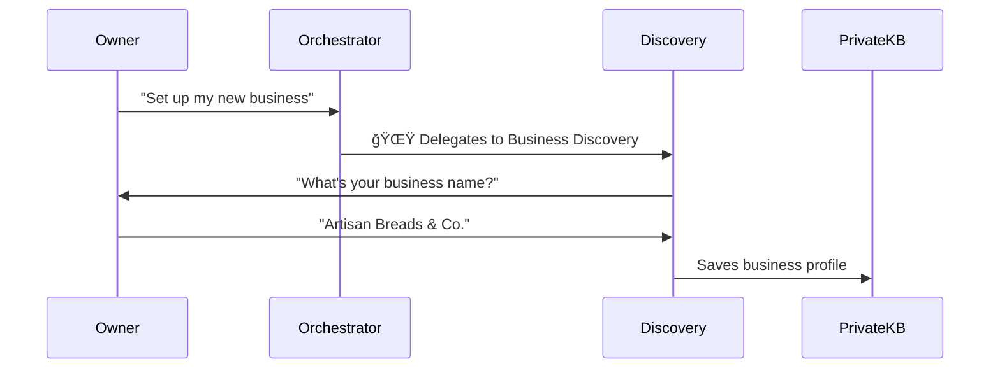
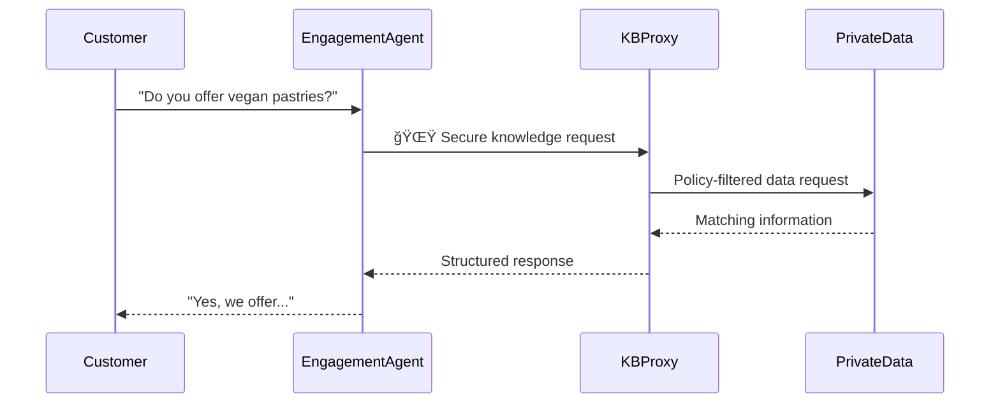

# Usage Guide & Demo Scenarios

This guide walks through two primary user journeys for SmallBizPal, demonstrating its core capabilities. This can be used as a script for a video demonstration.

**Prerequisites**: 
- Run `adk web` and open `http://localhost:8000` for the admin interface
- For the full demo, also run the public interface on `http://localhost:8001`

---

## Scenario 1: The Business Owner (Admin)

**Goal**: To set up a new business profile and generate marketing assets.

**Actor**: A small business owner.

### Step 1: Define the Business

The business owner starts by interacting with the main **Orchestrator** agent in the ADK Web UI.

#### Quick Interaction Flow

<strong>🬠Show Full Interaction</strong>

1.  **Start the conversation**: Send a message to the agent to kick things off.
    > **Owner**: "Hi, I need to set up my new business."

2.  **🌟 Orchestrator automatically delegates to Business Discovery Agent**: The system intelligently routes the request.
    > **Agent**: "Of course! I can help with that. To start, what is the name of your business?"
    >
    > **Owner**: "It's called 'Artisan Breads & Co.'"
    >
    > **Agent**: "Great. What products or services do you offer?"
    >
    > **Owner**: "We sell handcrafted sourdough bread, artisanal pastries, and fresh-brewed coffee."

3.  **Complete the Profile**: Continue this conversational process until the agent has gathered all necessary information (e.g., target audience, brand values, etc.). The agent will save this information to the private knowledge base (`data/knowledge_base.json`).

> 🔒 **Security Note**: All business data stays in the private admin application. See our [Secure Dual-App Model](ARCHITECTURE.md#secure-dual-application--a2a-model) for details.

### Step 2: Generate Marketing Content

Once the profile is complete, the owner can ask the **Orchestrator** to create marketing materials.

<strong>🨠Show Marketing Generation</strong>

1.  **Request Marketing Slogans**:
    > **Owner**: "Okay, now I need some marketing slogans for my bakery."

2.  **🌟 Marketing Agent automatically takes over**: The Orchestrator intelligently delegates to the Marketing Generator agent, which reads the business profile and generates brand-consistent content.
    > **Agent**: "Here are a few slogan ideas for Artisan Breads & Co.:"
    >
    > -   "Artisan Breads & Co.: Baked with passion, served with love."
    > -   "Experience the craft in every crumb."
    > -   "Your daily dose of handcrafted happiness."

**🯠Key Capability**: The owner can similarly request ad copy, social media posts, and more—all automatically tailored to their specific business profile.

---

## Scenario 2: The End Customer (Public)

**Goal**: To ask a question and book a meeting with the business.

**Actor**: A potential customer visiting the business's website.

**Setup**: For this scenario, imagine the `Customer Engagement Agent` is embedded as a chat widget on the company website. In the ADK Web UI, you can simulate this by selecting the `customer_engagement_agent` from the agent dropdown list.

### Step 1: Ask a Question

The customer interacts with the public-facing chatbot.

#### Secure Knowledge Access Flow

<strong>💬 Show Customer Conversation</strong>

1.  **Open the Chat**: The customer clicks the chat widget.
    > **Agent**: "Hello! Welcome to Artisan Breads & Co. How can I help you today?"

2.  **Ask about Products**: The customer has a specific dietary question.
    > **Customer**: "Do you offer any vegan pastries?"

3.  **🌟 Agent securely accesses knowledge via KB-Proxy**: The system maintains security boundaries while providing rich answers.
    > **Agent**: "Yes, we do! Our vegan options include the 'Apple Crumble Danish' and our 'Chocolate Avocado Mousse Tart'. Would you like to know more about them?"

> 🔒 **Security Highlight**: The Customer Engagement Agent never directly accesses private business data—all queries go through the secure KB-Proxy layer.

### Step 2: Schedule a Meeting (Lead Capture)

The customer is interested in a large order and wants to speak with someone.

<strong>📅 Show Lead Capture Process</strong>

1.  **Request a Meeting**:
    > **Customer**: "I'd like to place a large order for an event. Can I speak with someone?"

2.  **🌟 Agent automatically initiates intelligent lead capture**: The system recognizes high-value intent and guides the conversation.
    > **Agent**: "Absolutely! I can help you set up a consultation. First, can I get your name and email address?"
    >
    > **Customer**: "My name is Alex Smith, and my email is alex@example.com."
    >
    > **Agent**: "Great! And what is the event about? This will help us prepare for the meeting."
    >
    > **Customer**: "It's for a corporate breakfast next month."

3.  **🌟 Automatic lead storage and confirmation**: The system captures structured lead data for later analysis.
    > **Agent**: "Thank you, Alex! We've scheduled a consultation for you. Someone from our team will reach out to you at alex@example.com within 24 hours to finalize the details. We look forward to working with you!"

**📊 Business Impact**: This lead is automatically stored in `data/leads/leads.json` and will be analyzed by the Performance Reporting Agent to provide business insights.

---

## 🯠Demo Summary

This completes the user journey, showcasing how SmallBizPal handles:

- **🔠Secure dual-application architecture** (admin vs. public data boundaries)
- **🤖 Intelligent multi-agent orchestration** (automatic task delegation)
- **📈 End-to-end business workflow** (from setup to customer conversion)
- **ğŸ›¡ï¸ Zero-trust security model** (KB-Proxy data filtering)
